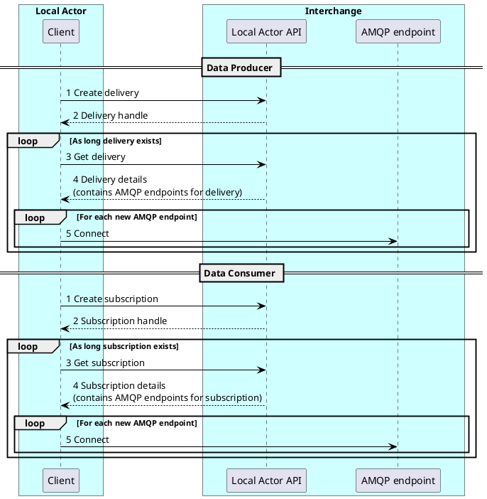

# Connection Management

Even after successful connection of the initial AMQP connection(s), the delivery/subscription needs to be monitored by the client by polling the related endpoint.

!!! warning
    **If a created delivery or subscription is not polled for it’s status, it will be deprovioned (deleted) after a certain time.**
    

The following changes need to be processed when polling deliveries/subscriptions:

- Status changes
- Added AMQP endpoints
- Removed AMQP endpoints

In order to illustrate this concept a simplified sequence diagram is shown below:

