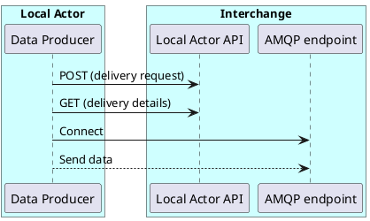
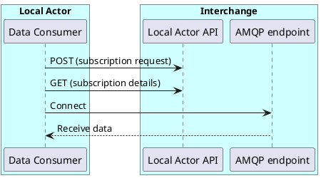

# Introduction

The Local Actor API is a HTTP JSON-REST based interface for requesting AMQP 1.0 (see [AMQP 1.0](amqp.md)) endpoints/connections for data delivery (for producing data) and data subscription (for consuming data). The API has been developed to support Basic Interface compliant C-ITS Actor connections with a C-ITS Interchange as defined by C-Roads (see [C-Roads](c-roads.md)).

This document currently only describes the part of the API that is relevant for setting up (and maintaining) deliveries and/or subscriptions.

- Clients that want to **produce** data will need to create and monitor a **delivery** using this API.
- Clients that want to **consume** data will need to create and monitor a **subscription** using this API.

The creation of the delivery/subscription through this API will trigger a server side endpoint provisioning required for the client to start sending/receiving data.

If the creation of the delivery or subscription is successful, the delivery/subscription must be “polled” in order to obtain the current status and AMQP endpoints to use.

## Deliveries

## Subscriptions

